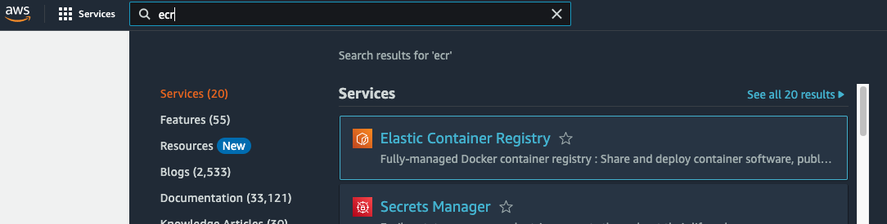
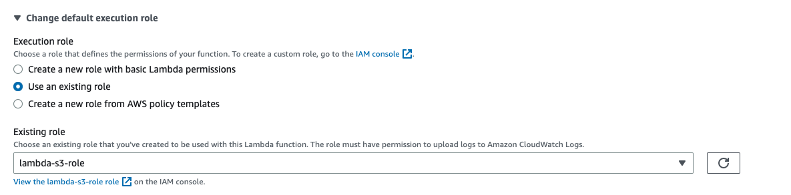

# An API to Extract Time Windows from the SCEDC Public Data Set

This tutorial creates an API that runs an AWS Lambda function to extract timewindows from the SCEDC Public Data Set and stream the waveforms in JSON format. An API like this 
can be used to feed other services.

These are the steps to create an API and Lambda function:

1. Write your custom code and a Lambda handler.
2. Create a Docker image based on an AWS Lambda base image that installs dependencies and the Lambda handler. 
3. Test the Lambda function locally.
4. Push the Docker image to Amazon Elastic Container Registry.
5. Create the Lambda function from the Docker image.
6. Set up an API Gateway, to call the Lambda function.

## Writing the Code.

In this example, `app.py` contains the code for the Lambda function. It returns an HTTP status code, a Content-Type header, and the waveforms as a JSON string if it detects that the request originates from API Gateway. 

```python
def process(event):
    """ Lambda function handler.
    """
    
    if 'routeKey' in event:
        api_gateway = True
        event = json.loads(event['body'])
    
    # ...  Code to download and process waveforms from the get waveforms.

    if api_gateway:    
        return { 
            'statusCode': 200,
            'headers': { 'Content-Type': 'application/json'},
            'body': json.dumps(waveforms)
        }
    else:
        return waveforms

```

The waveforms are downloaded into the Lambda container from the Public Data Set:

```python
try:
    s3.download_file(s3_input_bucket, key, infile)
    download_succeeded = True
except Exception:
    print('Could not download {} from {} to {}'.format(key, s3_input_bucket, infile))
```    

and ObsPy is used to extract the data points in the desired time windows:

```python
st = obspy.read(wf_file).merge()
st.trim(start_time, end_time)

wf_dict = {}
trace = st[0]
# ... Populate wf_dict metadata.
# Store the data points as a list in wf-dict['data'].
data_list =  trace.data.tolist()
wf_dict['data'] = data_list
```

The logic in `app.py` can be modified to create your own Lambda functions.

The Python modules required by `app.py` are listed in `requirements.txt`.

## Creating a Docker Image

The `Dockerfile` imports an Amazon base image for Python 3.10 Lambda functions:
```
FROM public.ecr.aws/lambda/python:3.10
```

It copies `requirements.txt` into the image and runs pip to install the Python modules listed there:
```
COPY requirements.txt  .
RUN  pip3 install -r requirements.txt --target "${LAMBDA_TASK_ROOT}"
``` 

It also copies `app.py` to the location in `$LAMBDA_TASK_ROOT`, which is a built-in AWS Lambda environment variable, and sets the `handler` function as the entrypoint:


```
COPY app.py ${LAMBDA_TASK_ROOT}
CMD [ "app.handler" ] 
```

Run the `docker build` command to build a Docker image

```
docker build -t timewindow-lambda .
```
    
`timewindow-lambda` is the name of the image.

## Testing the Function Locally

1. Create an input request like `request.json`. The format of the input request is a JSON array of time windows:
```json
{
    "Windows": [
        {
            "Network": "CI",
            "Station": "BOM",
            "Channel": "BHZ",
            "Location": "  ",
            "Starttime": "2024-01-01T00:00:00",
            "Endtime": "2024-01-01T00:05:00"
        },
        {
            "Network": "CI",
            "Station": "BOM",
            "Channel": "BHN",
            "Location": "  ",
            "Starttime": "2024-01-01T00:00:00",
            "Endtime": "2024-01-01T00:05:00"
        }
    ]
} 
```

2. Run the timewindow-lambda Docker image, forwarding port 8080 of the container to port 9000 on your computer so that you can connect to it. You will need to set AWS IAM credentials as environment variables. Run the following command in your terminal:

```
docker run -d -p 9000:8080 timewindow-lambda
```

If you tagged your image with a name different from `timewindow-lambda`, use the name of that image instead of `timewindow-lambda`. Run `docker ps` to get the ID of the container.

3. Run the following command to send `request.json` to the Docker container and save the results to `output.json`:

```
curl -X POST -d @request.json http://localhost:9000/2015-03-31/functions/function/invocations -o output.json
```

4. Stop the Docker container by getting its ID from the output of `docker ps` and running `docker stop`.

## Pushing the Docker Image to ECR
  
1. Go to the ECR (Elastic Container Registry) service from your AWS console.



2. Click "Get Started."

3. Make sure Oregon is selected as the region in the upper right corner of your window, and enter a name for your repository.

4. Scroll down and click "Create Repository."

6. Click the check box next to the repository name. Then click "View Push Commands."

7. Copy and paste and run the docker commands in your terminal to log in, tag the latest image, and push the image to rhe repository.

## Creating an IAM Role for the Lambda Function

1. Go to the IAM service from your AWS console.

2. Click on "Roles" under "Access Management." 

3. Click "Create Role."

4. Scroll down and select "Lambda" under "Common Use Cases." Click "Next."


5. Select AWSLambdaBasicExecution.

6. Do the same for CloudwatchLogsFullAccess. This may be required for debugging the Lambda function.

7. Enter a name and description for the role, and click "Create Role."

## Creating the Lambda Function

1. Go to the Lambda service from your AWS console. Make sure you are in the Oregon region.

2. Click "Create Function."

3. Select "Container image."

4. Enter a name for your function.

5. Click "Browse Images."

6. Click "Select Repository" and your ECR repository name.

7. Select your image, and click "Select image."

8. Open "Change default execution role" to open it. Select "Use an existing role." 

9. Click the down arrow next to the "Existing role" field, and select the role that you created earlier.



10. Click "Create Function."

## Configuring the Lambda Function

These steps configure the response Lambda function in this repository. Settings for other Lambda functions will differ.

1. Scroll down and click "Configuration."

2. Click "Edit."

3. Change memory to 2048 MB. Change the timeout to 1 min.

4. Click "Save."


## Links

[Amazon Elastic Container Registry](https://aws.amazon.com/ecr/)

[AWS Lambda](https://aws.amazon.com/lambda/)

[Building Lambda Functions with Python](https://docs.aws.amazon.com/lambda/latest/dg/lambda-python.html)

[Deploy Python Lambda functions with container images](https://docs.aws.amazon.com/lambda/latest/dg/python-image.html)

[Welcome to AWS Re:Invent 2022](https://catalog.us-east-1.prod.workshops.aws/workshops/a17b1a12-4c81-428a-b5c7-8e9c4cae002d/en-US/setup)
