# Creating a Lambda Function and API to Process Open Data Set Files

This tutorial will show you how to use Docker to create a Lambda function that uses ObsPy to decimate a data file
from the the SCEDC Open Data Set and stores the resulting file an S3 bucket in your account. 

You will be using a Cloud9 environment to create and upload a Docker image to ECR that contains processing code and ObsPy. You will then create a Lambda function using the Docker image 

The code for the Lambda function is in [`app.py`](app.py). You can modify it to create Lambda functions that do different types of processing on Public Data Set files.

## Setting up S3 and Cloud9

1. Log in to the AWS console.

2. Navigate to the S3 service.

3. Click on "Create bucket."

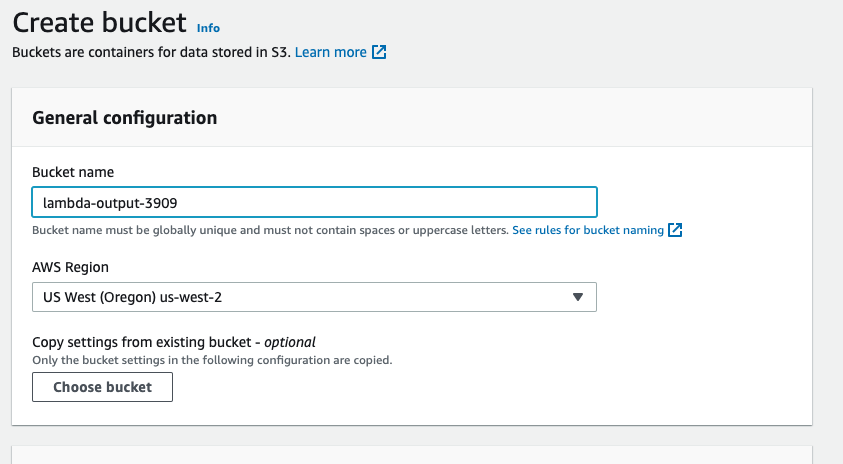

4. Create a bucket with the name `lambda-output-` followed by the last four digits of your account number. The rest of the settings don't need to be changed. Your Lambda function will write to this bucket.

5. Navigate to the Cloud9 service. Make sure Oregon (us-west-2) is the region selected in the upper right corner.

6. Click "Create Environment."

7. Choose a name for your environment. Choose `t3.small` for the instance type should be sufficient. `t2.micro` does not work in the US-West-2 region.

8. Click "Create."

9. On the next screen, wait for the environment to finish being created.

10. Click "Open" to open the Cloud9 IDE. In the IDE, the terminal is at the bottom of the workspace. The file explorer is on the right.

## Creating a Docker Image

1. From your Event Engine login page, copy the "export" statements. Paste them into your terminal and hit ENTER. These statements set your AWS keys and session token as environment variables and make sure you have permission to run `aws` commands from the terminal.

2. In Cloud9, click the button in left sidebar above the "aws" logo. Click "Clone Repository."
Paste https://github.com/SCEDC/tutorials.git into the "Repository URL" field and hit Enter.

3. Click on the folder icon in the sidebar to navigate the filesystem.  You can open files in the IDE by double clicking them. The files for this tutorial are in `tutorials/pds-lambda-docker`.

4. In the terminal, navigate to tutorials/pds-lambda-docker.

    `cd tutorials/pds-lambda-docker`

5. Choose a name for your Docker image, like decimation-lambda, or my_docker_image, and run the command below to build the image using the provided Dockerfile.
  
    `docker build -t decimation-lambda .`

    This Dockerfile builds a Docker image based on AWS's lambda/python:3.8 base image that has ObsPy installed. ObsPy and its dependencies are listed in `requirements.txt`. The Dockerfile also tells Docker to make a copy of `app.py` in the image and to run the function `app.handler` as the entrypoint for the Lambda function. 
 
## Uploading the Docker Image to ECR
  
1. Go to the ECR (Elastic Container Registry) service from your AWS console.

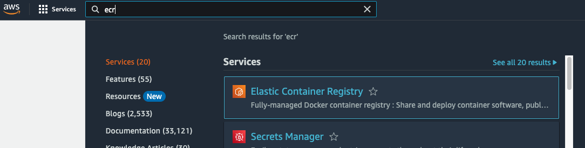

2. Click "Get Started."

3. Make sure Oregon is select as the region in the upper right corner of your window, and enter a name for your repository.

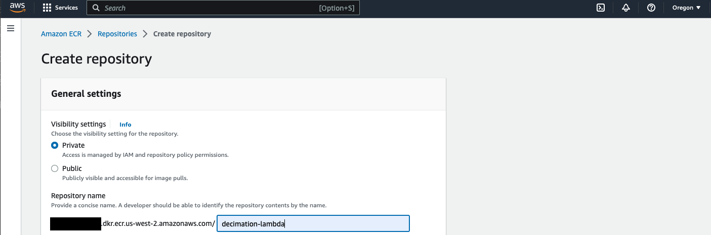

4. Scroll down and click "Create Repository."

6. Click the check box next to the repository name. Then click "View Push Commands."

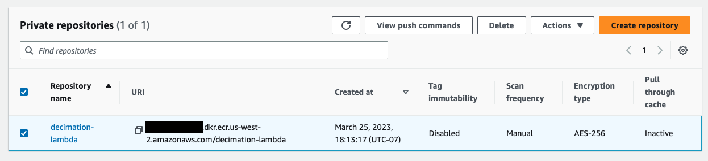

7. Copy and paste the `aws ecr` command into the Cloud9 terminal and run it to authenticate your Docker client.

8. Copy and paste the `docker tag` command into the terminal and run it to tag the image. 

9. Copy and paste the `docker push` command to upload the image. If you click on your Docker repository on the ECR page, you should see the latest image.

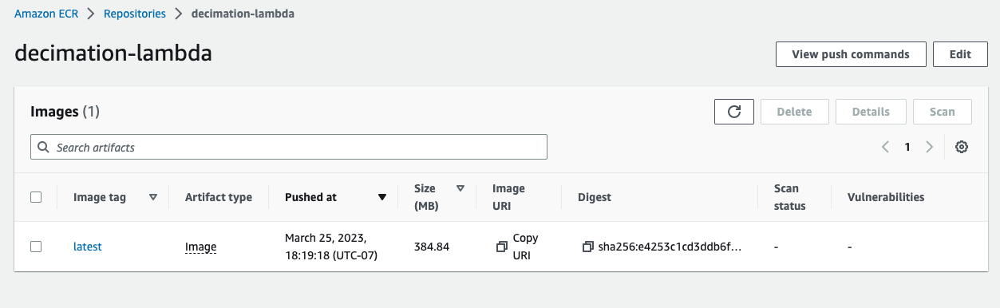

## Creating an IAM Role for the Lambda Function

1. Go to the IAM service from your AWS console.

2. Click on "Roles" under "Access Management." 

3. Click "Create Role."

4. Scroll down and select "Lambda" under "Common Use Cases." Click "Next."

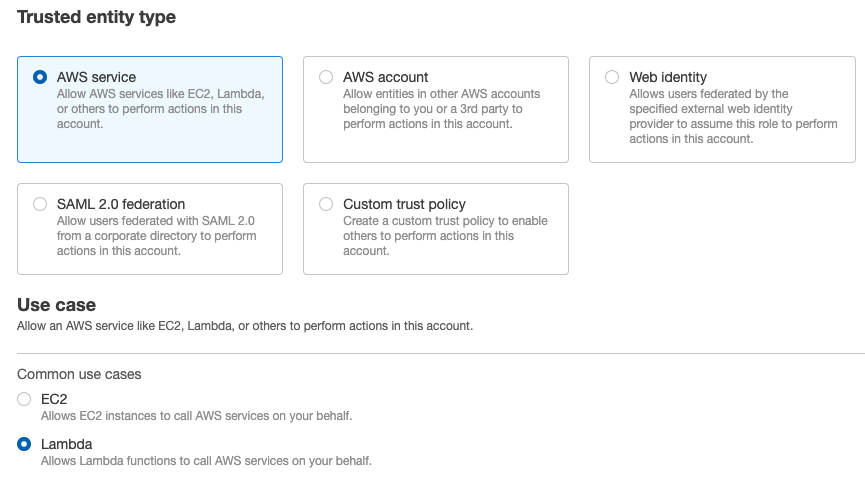

5. Select AWSLambdaBasicExecution.

6. In the search box, type `AmazonS3Full`. Select AmazonS3FullAccess, and click Next.

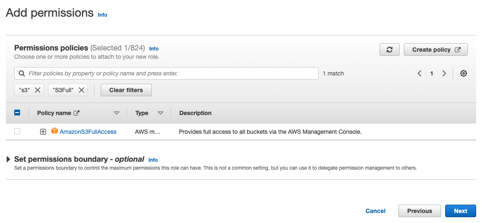

   Do the same for CloudwatchLogsFullAccess. This may be required for debugging the Lambda function.

7. Enter a name and description for the role, and click "Create Role."

   This is what your permissions should look like:

   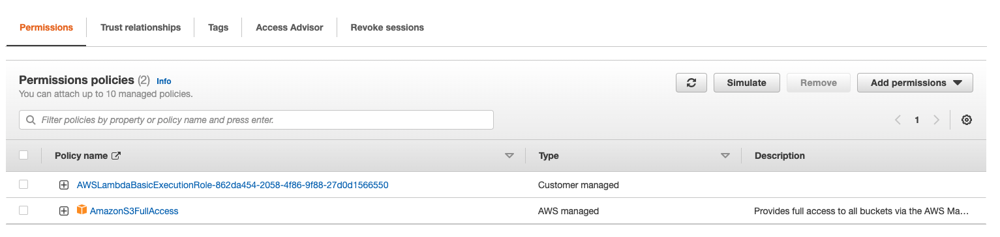

## Creating and Running the Lambda Function

1. Go to the Lambda service from your AWS console. Make sure you are in the Oregon region.

2. Click "Create Function."

3. Select "Container image."

4. Enter a name for your function.

5. Click "Browse Images."

6. Click "Select Repository" and your ECR repository name.

7. Select your image, and click "Select image."

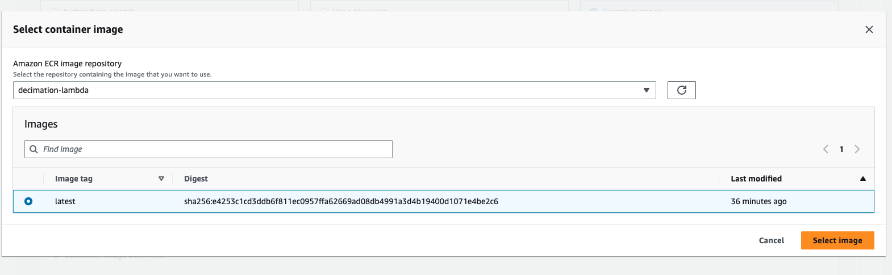

8. Open "Change default execution role" to open it. Select "Use an existing role." 

9. Click the down arrow next to the "Existing role" field, and select the role that you created earlier.

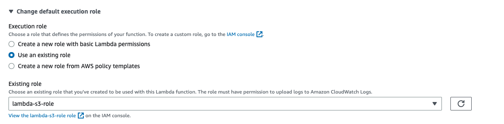

10. Click "Create Function."

11. Scroll down and click "Configuration."

12. Click "Edit."

13. Change memory and ephemeral storage to 1024 MB. Change the timeout to 1 min.

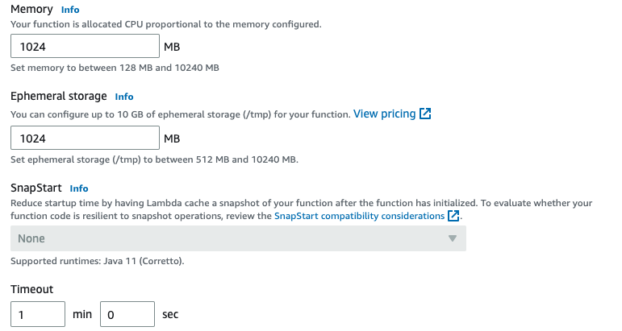

14. Click "Save."

15. Click "Functions" to return to the list of functions, and click your function's name to load it.

16. Click on "Test."

17. Create a name for your test event, and paste the following code into the "Event JSON" box.

    ````
    {
      "s3_input_bucket": "scedc-pds",
      "s3_output_bucket": "YOUR_OUTPUT_BUCKET",
      "s3_key": "continuous_waveforms/2016/2016_123/CIWCS2_BHE___2016123.ms",
      "decimation_factor": 4
    }
    ````

    Make sure to replace "YOUR_OUTPUT_BUCKET" with the name of the bucket your created earlier. `s3_input_bucket` is the SCEDC Public Data Set. `s3_key` is the key of the waveform from the Public Data Set that will be decimated. 

    Click "Test" to run the Lambda function.

18. Hopefully, you will see the message "Execution result: succeeded." You can open the details to see that the function has returned an output_key in your bucket. This is the decimated file. From the terminal, you can run:

    ````
    aws s3 ls s3://YOUROUTPUTBUCKET/
    ````

to see that it now has decimated in it.

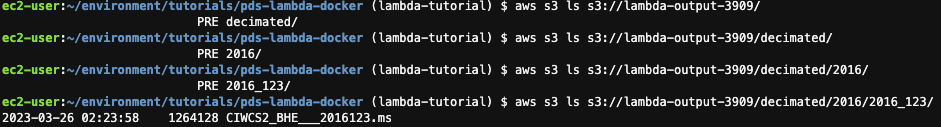

[`run_lambda.py`](run_lambda.py) contains code for invoking your lambda function using the Boto3 library. To run it in Cloud9, you will need to install boto3. You will also need to change the Lambda function name and S3 output bucket in the code.

```
    pip install boto3
    python run_lambda.py
```

## (Optional) API Gateway

In this section, you will create an API for your Lambda function that will let it accept requests over HTTP, and you will test it using `curl`. An API can be integrated into web services without using AWS libraries.

1. From the console, navigate to API Gateway.

2. Click "Create API."

3. Click "Build" under "HTTP API."

4. Click "Add Integration." 

5. Click the down arrow in the text box, and select "Lambda."

6. Click the box with the magnifying glass, and your Lambda function should appear as an option. Select it so that it appears in the box.

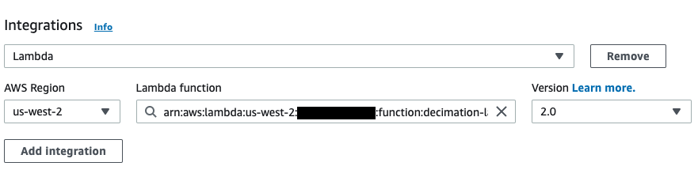

7. Choose a name for the API, and click "Next."

8. Choose POST as the route.

9. Enter a resource path. This is what appear after the last '/' in your API's URL: https://your-api/resource_path. Click "Next."

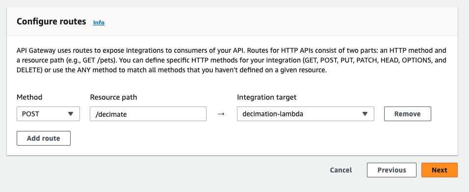

10. Click "Next" on the next screen.

11. Click "Create."

12. On the next screen, you can find your API's URL listed under "Stages." 

13. Open `request.json` in the Cloud9 IDE, and change the value of `s3_output_bucket` to your own bucket. To decimate    different files, change the value of `s3_key`.

13. Call your API by running:

    ````
    curl -X POST -H "Content-Type: application/json" -d @request.json https://your-api-url/decimate
    ````

    Replace `your-api-url` with the actual URL. This comment sends the contents of `request.json` to the API.

## Links

[Amazon Elastic Container Registry](https://aws.amazon.com/ecr/)

[AWS Lambda](https://aws.amazon.com/lambda/)

[AWS Cloud9](https://aws.amazon.com/cloud9/)

[Building Lambda Functions with Python](https://docs.aws.amazon.com/lambda/latest/dg/lambda-python.html)

[Deploy Python Lambda functions with container images](https://docs.aws.amazon.com/lambda/latest/dg/python-image.html)

[Welcome to AWS Re:Invent 2022](https://catalog.us-east-1.prod.workshops.aws/workshops/a17b1a12-4c81-428a-b5c7-8e9c4cae002d/en-US/setup)
