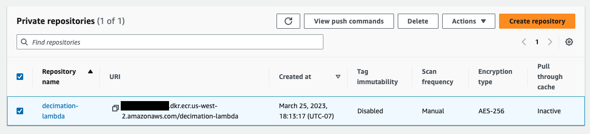
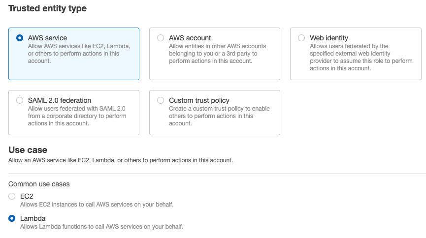
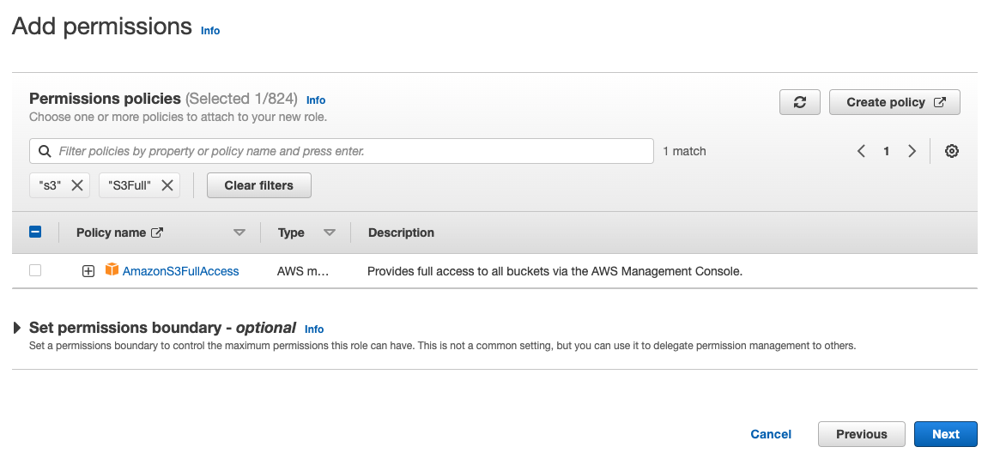

# Processing SCEDC Open Data Set Waveforms with ObsPy in AWS Lambda

Using Docker, you can write your own Amazon Lambda function that uses ObsPy to processes waveforms from the SCEDC Open Data Set and writes the resulting data to your own S3 bucket. This means that you do not need to provision EC2 servers, nor do you need to allocate local storage space for waveforms.

The original method of creating Lambda functions packages the function and library code in zip files. However, because of the size of ObsPy and its dependencies, fitting everything into zip files that meet Amazon's restrictions is difficult. Instead, you can install ObsPy, any other needed libraries, and your function handler in a Docker image deployed to Amazon ECR (Elastic Container Registry) and create a Lambda function from the image. The image you build can use one of Amazon's Python base images, or it can use a base image that already has ObsPy installed.

In summary, the steps to create your own ObsPy-based Lambda function are as follows:

1. Write your custom code and a Lambda handler in `app.py`.
2. Create a Docker image that has ObsPy, other dependencies, and `app.py` installed. 
3. Test the Lambda function locally.
4. Push the Docker image to Amazon Elastic Container Registry.
5. Create the Lambda function from the Docker image.
6. Optionally, set up triggers, such as an API Gateway, to run the Lambda function.

This repository contains the code for a sample Lambda function that removes the response from a waveform file from the SCEDC Public Data Set and writes the resulting waveform to an S3 bucket specified as an environment variable when creating the function. This tutorial will explain how to create this Lambda function and how to adapt the steps to writing your own custom processing Lambda function.

## Writing the Code.

The code for your Lambda function needs a handler function that accepts the input parameters of a Lambda request and a context object. In Python, the input parameters are a dictionary, and the output is also a dictionary. 

In this repository, the code is written in a file named `app.py`. Later, the handler function in `app.py` will be specified as the entrypoint of the Docker container that runs the Lambda. The handler just passes the parameters on a `process` function that does all the work.

```python
def handler(event, context):
    """ Lambda function handler.
    """
    
    response =  process(event)
    
    if api_gateway:
        return {
            'statusCode': 200,
            'body': json.dumps(response),
        }
    else:
        return response
```

You can reuse this function in your own version of `app.py` and write a different `process` function that does the processing you need. 

The code in this repository removes the station response from a continuous waveform file from the SCEDC Public Data Set and writes the resulting waveform to an output S3 bucket. First, it identifies and downloads the original waveform file from the Public Data Set, storing it in /tmp in the Lamba image. Then it downloads the StationXML file for the waveform, also from the Public Data Set, and stores it in /tmp. It then creates an ObsPy inventory object from the StationXML and passes the waveform file and the inventory to ObsPy's `stream.remove_response` method. The resulting waveform is written to /tmp and then uploaded to the output S3 bucket. The output key name is returned in a dictionary.


## Creating a Docker Image

Start by creating a file named `Dockerfile`.

The first line of the Dockerfile imports a base image. For Lambda, either use one of Amazon's provided base images or an image based on Amazon's.

Create a file name `requirements.txt` that lists needed Python modules. The following lines in the Dockerfile tell Docker to copy `requirements.txt` into the Docker image and run pip3 to install the modules in it into the AWS Lambda root directory.

```
COPY requirements.txt  .
RUN  pip3 install -r requirements.txt --target "${LAMBDA_TASK_ROOT}"
```

Copy `app.py` into the path for Lambda using a built-in variable of the base image;

```
COPY app.py ${LAMBDA_TASK_ROOT}
```

Set the handler function to be the entrypoint of the container:

```
CMD [ "app.handler" ] 
```

Run the `docker build` command to build a Docker image. If you are building an image with a different name, replace `response-lambda` with the name you are using.

```
docker build -t response-lambda .
```
    
## Uploading the Docker Image to ECR
  
1. Go to the ECR (Elastic Container Registry) service from your AWS console.


2. Click "Get Started."

3. Make sure Oregon is select as the region in the upper right corner of your window, and enter a name for your repository.


4. Scroll down and click "Create Repository."

6. Click the check box next to the repository name. Then click "View Push Commands."



7. Copy and paste the `aws ecr` command into your terminal and run it to authenticate your Docker client.

8. Copy and paste the `docker tag` command into your terminal terminal and run it to tag the image. 

9. Copy and paste the `docker push` command into your terminal and run it to upload the image. If you click on your Docker repository on the ECR page, you should see the latest image.


## Creating an IAM Role for the Lambda Function

1. Go to the IAM service from your AWS console.

2. Click on "Roles" under "Access Management." 

3. Click "Create Role."

4. Scroll down and select "Lambda" under "Common Use Cases." Click "Next."



5. Select AWSLambdaBasicExecution.

6. In the search box, type `AmazonS3Full`. Select AmazonS3FullAccess, and click Next.



   Do the same for CloudwatchLogsFullAccess. This may be required for debugging the Lambda function.

7. Enter a name and description for the role, and click "Create Role."

## Creating the Lambda Function

1. Go to the Lambda service from your AWS console. Make sure you are in the Oregon region.

2. Click "Create Function."

3. Select "Container image."

4. Enter a name for your function.

5. Click "Browse Images."

6. Click "Select Repository" and your ECR repository name.

7. Select your image, and click "Select image."


8. Open "Change default execution role" to open it. Select "Use an existing role." 

9. Click the down arrow next to the "Existing role" field, and select the role that you created earlier.


10. Click "Create Function."

11. Scroll down and click "Configuration."

12. Click "Edit."

13. Change memory to 2048 MB. Change the timeout to 1 min.


14. Click "Save."

15. Click "Functions" to return to the list of functions, and click your function's name to load it.

16. Click on "Test."

17. Create a name for your test event, and paste the following code into the "Event JSON" box.

    ```
    {
        "day": "2019,183",
        "nscl": "CI.SOC.HHZ."
    }
    ```

    Click "Test" to run the Lambda function. The Lambda function will download and remove the channel response from 2019, day 183 waveform for the channel CI.SOC.HHZ and upload the resulting waveform to the S3 bucket specified in the S3_OUTPUT_BUCKET environment variable.

## Running the Lambda Function

[`run_lambda.py`](run_lambda.py) contains code for invoking your lambda function using the Boto3 library. To run it in Cloud9, you will need to install boto3. You will also need to change the Lambda function name and S3 output bucket in the code.

```
    pip install boto3
    python run_lambda.py
```

## Links

[Amazon Elastic Container Registry](https://aws.amazon.com/ecr/)

[AWS Lambda](https://aws.amazon.com/lambda/)

[AWS Cloud9](https://aws.amazon.com/cloud9/)

[Building Lambda Functions with Python](https://docs.aws.amazon.com/lambda/latest/dg/lambda-python.html)

[Deploy Python Lambda functions with container images](https://docs.aws.amazon.com/lambda/latest/dg/python-image.html)

[Welcome to AWS Re:Invent 2022](https://catalog.us-east-1.prod.workshops.aws/workshops/a17b1a12-4c81-428a-b5c7-8e9c4cae002d/en-US/setup)
